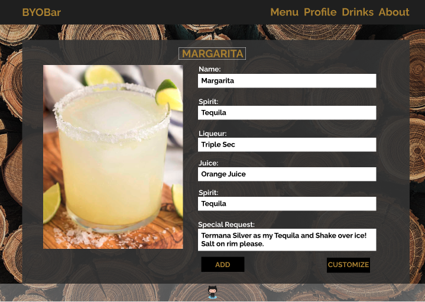
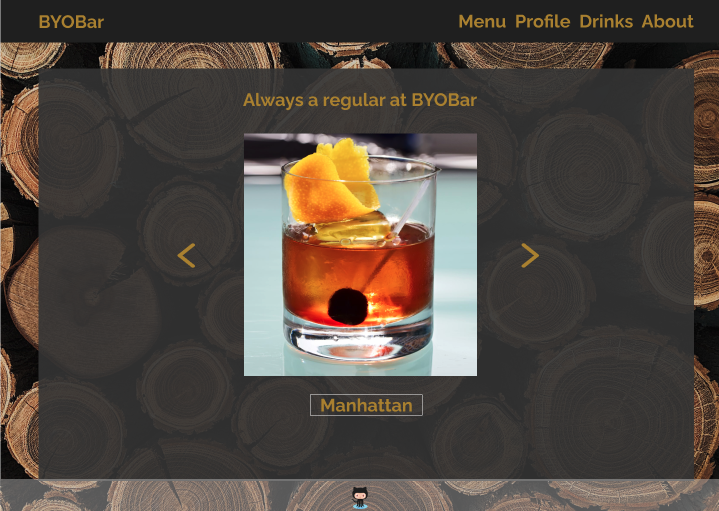
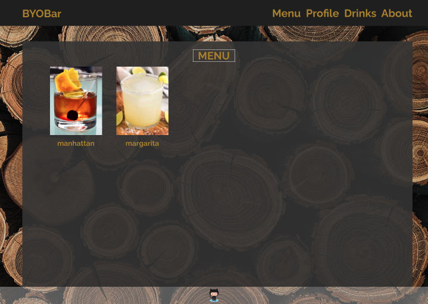
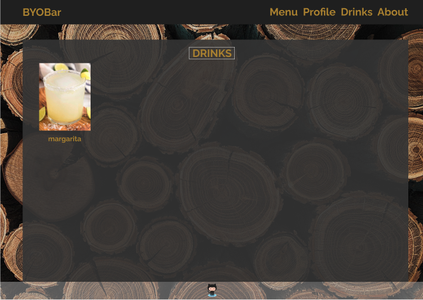
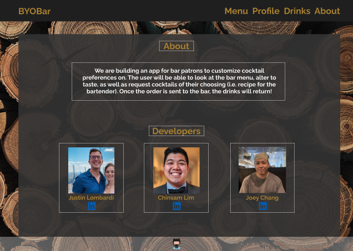
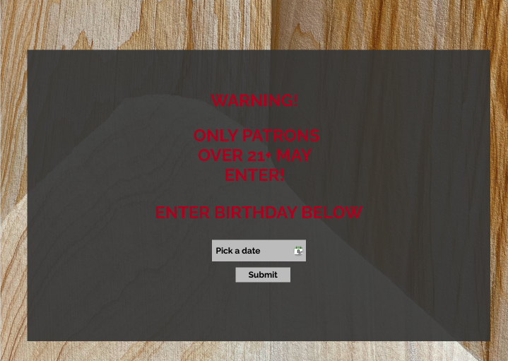

# BYOBar -- Frontend

## Application Description

> BYOBar was designed by three developers who have a passion for connecting with others and making people feel like they're part of the family. With our app, we are able to give that experience to you, the user, and you are always able to show off your style and preferences in cocktail form!

### Link to BYOBar Backend Repository:

https://github.com/build-your-own-bar/build-your-own-bar-backend

## Technologies Used

- React
- CSS
- Animate.css
- Material UI
- Email JS
- React Bootstrap
- React Router
- Axios

## Installation

1. Fork and clone this repo to your local machine
2. In your terminal, `cd` into the project directory
3. Run `npm i` to install dependencies
4. Open your code editor with `code .`
5. Run `npm start` to run the frontend locally

## Current Application State

# Future Improvements

- We would like to add a feature that allows you to visit other member profiles so you can see their drink list.
- We would like to add a favorites feature that allows a user to choose their favorite drinks and lets them view them whenever they're signed in.
- We would also like to finish our Agnular version of this!

# Contribution Guidelines

## How to Identify Bugs

> If you identify bugs, submit an issue on the Git repo. Please detail the bug in your issue. If you know how to fix it, feel free to note the methods you would use. You could also submit a pull request with suggested code to fix it.

# Initial Planning

https://trello.com/b/q1Q4pewQ/byob

## User Stories

- As a user, I want to be able to save my list of drinks in my profile when I sign in so I can keep track of my favorite concoctions.
- As a user, I want to be able to create my preferences on a specific cocktail on the menu so the bartender knows how to prepare my drink.
- As a user, I want to plug in my birthday to see if I’m old enough to enter the site.
- As a user, I want to be able to see all the created cocktails.
- As a user, I would like to update and push a cocktail into my own menu.

Stretch:

- As a user, I would like to view other members’ profiles so I can see their favorite drinks and preferences.

### Wireframes

### Unsolved Problems / Major Hurdles

> The biggest hurdle we faced was getting the Comment section of each drink to work the way we wanted it to. We had some strange interactions with our backend and spent the most time debugging this. We did end up fixing it though!

### Contributors

- Chinsan Lim (https://github.com/chinsan-lim)
- Joey Chang (https://github.com/joesphchang)
- Justin Lombardi (https://github.com/thejustinlombardi)
